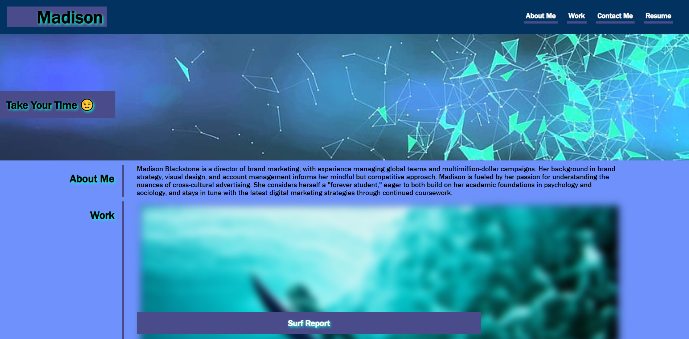

# my-portfolio
this is the 2nd assignment

# About
this is a portfolio made about Madison and later on i will change it to be about me 

# tools
used HTML and CSS comands we learned in Bootcamp class plues google, var, before, classes , font styles and flex 

# img 
got it from google 

# screan shot 
below purview

